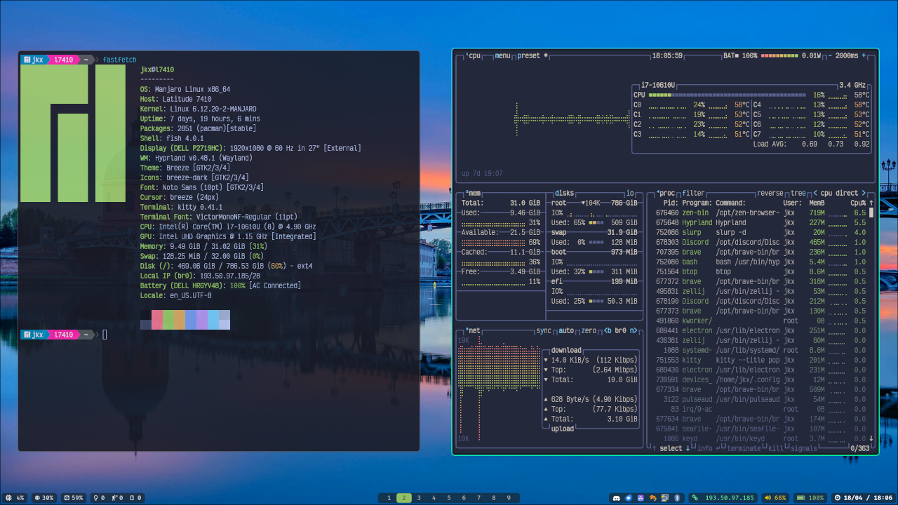
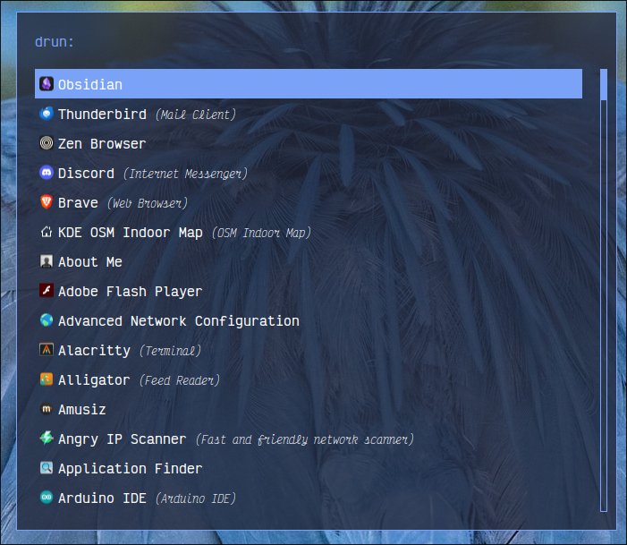
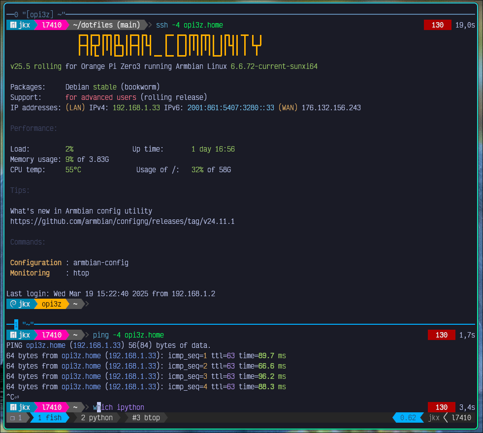
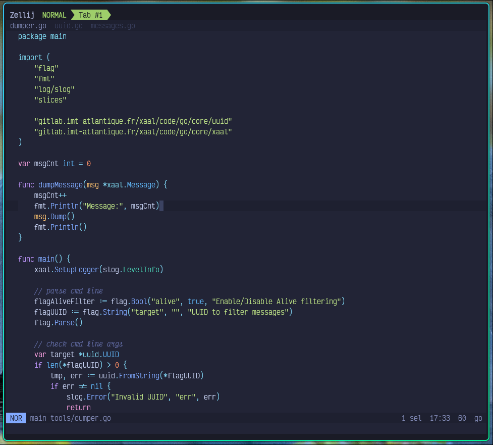

# Dotfiles

This repo contains my configuration for severals software (mainly console).
The main usage is to share my configuration with others.

This repo is an automatic extract from my [chezmoi](https://www.chezmoi.io/)
repo (private). You can check out push.py to figure out how I do this.

My main shell for years is [Fish](https://fishshell.com/). I don't use extra
plugins for the look and feel. The prompt is made by myself that's all. I mainly
use Zellij to replace Tmux or screen, but I prefer to use Tmux in docker images.
Tmux, Zellij are also plugins free. In fact, I use chezmoi to replicate this
config on all my devices (servers etc), so I don't want to have to install extra
stuffs.

## Porn
I'm currently using
- [Hyprland](https://hyprland.org/)
- [Waybar](https://github.com/Alexays/Waybar)
- [Rofi](https://github.com/lbonn/rofi)
- [Kitty](https://sw.kovidgoyal.net/kitty/)

You can find below some screenshots

### Desktop
 

### Rofi
 

### Tmux
 

### Zellij + Helix Editor
 
